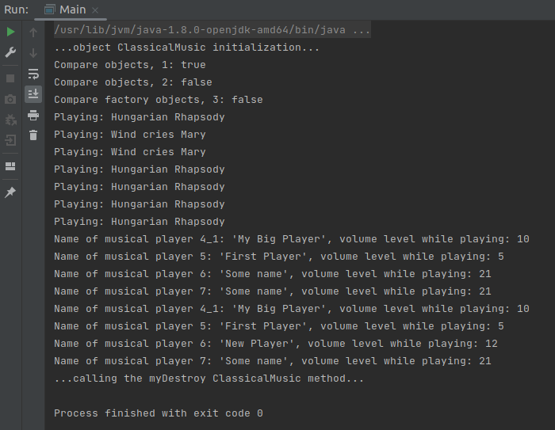

## Spring_evenMoreBeans_xml
<html></html>

Небольшой проект, использующий Spring + Beans + xml-конфгурацию.

Продолжение проектов:

	https://github.com/abambi-abambi/Spring_1stBean_xml
	https://github.com/abambi-abambi/Spring_moreBeans_xml

Проект использует и работает с:

	- OS: Linux (Ubuntu 21.04) 64-bits;
	- IDEA Community Edition;
	- Spring Framework;
	- Maven build tools;
	- Java 8 (JDK 1.8).

Для работы с проектом:

	- откройте проект в IDEA, запустите с помощью alt + shift + F10
		(запуск проекта из IDEA).

	- вот какой вывод будет в терминале:

<html></html>

	Объекты создавались 1) с использованием Bean и 2) старым способом.

	См. реализацию с комментариями в коде:
		- src/main/java/org/example2/Main.java;
		- src/main/java/org/example2/ModernMusic.java;
		- src/main/resources/applicationContext.xml;
		- src/main/resources/musicPlayer.properties.
		
~*~ часть 1, разъяснения ~*~

### Тема 1: Используются способы внедрения зависимостей:

	- через конструктор <constructor-arg>;
	- через сеттер <property name>:
		- через значения, указанные непосредственно в бине;
		- через значения, поступающие через внешний файл.

### Тема 2: Применяются разные scope в бинах: Singleton или Prototype

	см. файл с комментариями: src/main/resources/applicationContext.xml:
	- scope="prototype" или
	- по умолчанию [если не указан] scope="singleton"

### Тема 3: Обозначены init-method / destroy-method в бине

	см. методы в классе ClassicalMusic, задействован бин: <bean id="mymusic2">
	- init-method в <bean> вызывается до использования бина,
	- destroy-method в <bean> вызывается после использования бина.

### Тема 4: Реализован шаблон проектирования Factory

	см. методы в классе ClassicalMusic, задействован бин: <bean id="mymusic3">

### Этапы создания бина для сеттера

	1) создать поле в классе (для будущего бина);
	2) создать соответствующий сеттер в классе;
	3) создать bean в .xml-файле с кодом: <property name="name" value="myClassName">,
		где 'name' - это имя (метода) сеттера маленькими буквами без начала "set",
		а 'value' - это аргумент (нужного типа: класс-бин, инт и т.п.), который поступает в сеттер. Может использоваться ссылка 'ref' или значение 'value';
	4) раз используем сеттер, раз в коде уже есть конструктор с параметрами,
		то в классе обязательно должен быть явно создан(ный)
		конструктор без параметров, для данного примера кода;

~*~ часть 2, ссылки на материалы ~*~

### Ссылки:

	"Spring Framework. Урок 6: Внедрение зависимостей. Dependency Injection (DI). Часть 2."
	https://www.youtube.com/watch?v=dBxRmUH3Af8&list=PLAma_mKffTOR5o0WNHnY0mTjKxnCgSXrZ&index=6

	"Spring Framework. Урок 7: Bean scope (Область видимости бинов)."
	https://www.youtube.com/watch?v=IcwWPjeBpFU&list=PLAma_mKffTOR5o0WNHnY0mTjKxnCgSXrZ&index=7

	"Spring Framework. Урок 8: Жизненный цикл бина (Bean Lifecycle). Init, Destroy и Factory методы."
	https://www.youtube.com/watch?v=MVbBLoZrT2A&list=PLAma_mKffTOR5o0WNHnY0mTjKxnCgSXrZ&index=8

~*~ часть 3, дополнительно ~*~

### Быстрые клавиши, IDEA:

	alt + insert: вызов меню автогенерации (конструкторов и т.п.);

	ps (напечатать в коде программы): дальше всплывает подсказка,
		что создать, например, метод main() - "psvm";

	alt + shift + F10: запуск проекта из IDEA

### Tags:
Spring, Application Context, Inversion of Control, Dependency Inversion, xml, applicationContext.xml, *.properties, Factory pattern, Singleton pattern, Beans, scope for beans, constructors + beans, setters + beans, init-method + bean, destroy-method + bean.
